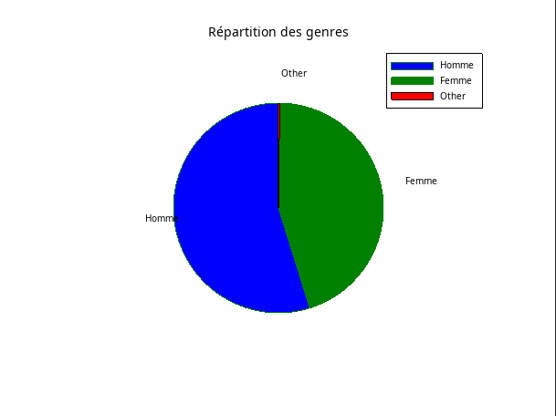
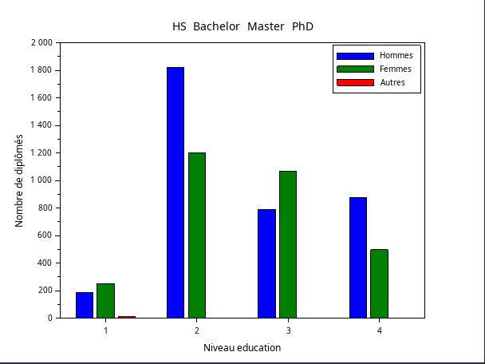
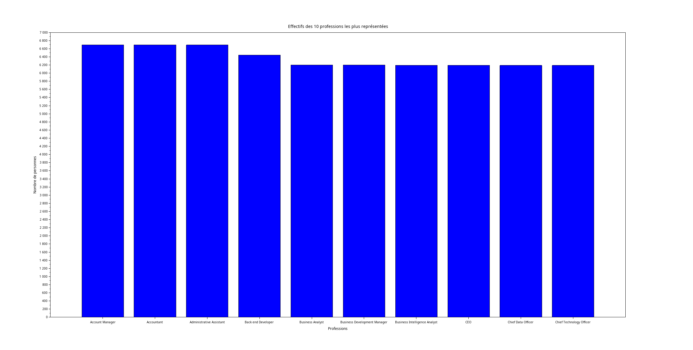
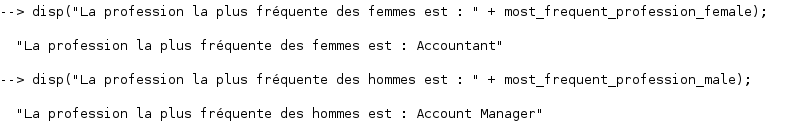
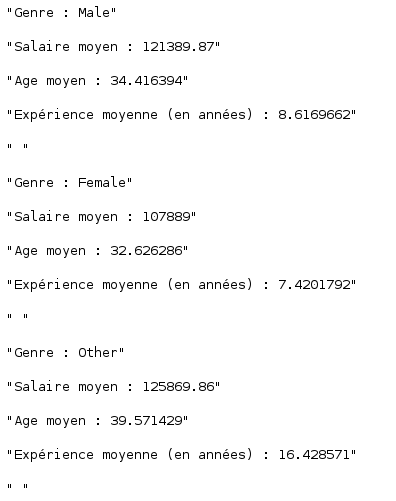
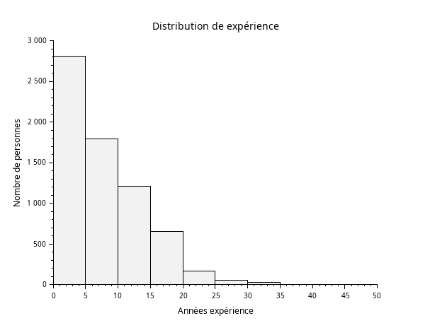
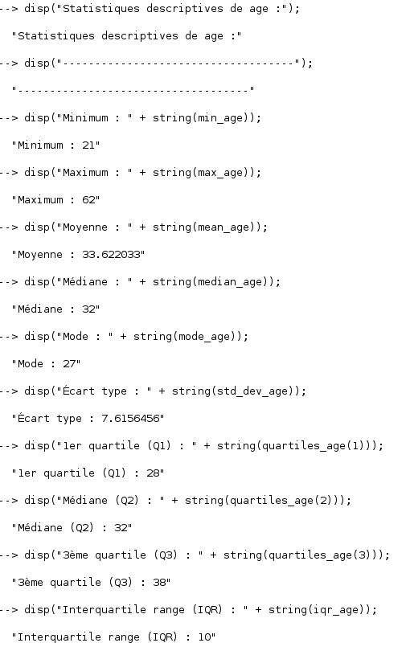

# SAEMATH

## Exercice 1

### 1)

```
// Charger les données du fichier data.csv
data_nbr = csvRead('data.csv');
data_txt = csvRead('data.csv', [], [], 'string');

// Initialisation des variables
genres = data_txt(:, 3);
nb_homme = sum(genres == 'Male');
nb_femme = sum(genres == 'Female');
nb_other = sum(genres == 'Other');

//Affichage du graphe
pie([nb_homme, nb_femme,nb_other], ['Homme', 'Femme','Other']);
title('Répartition des genres');
legend('Homme', 'Femme', 'Other');
```



### 2)

```
// Charger les données du fichier data.csv
data_nbr = csvRead('data.csv');
data_txt = csvRead('data.csv', [], [], 'string');

// Initialisation des variables issues des données du fichier data.csv
genders = data_txt(:, 3);
education_levels = data_nbr(:, 4);

// Nombre de diplomé pour chaque combinaison de genre et de niveau d'études
male_HS = sum(genders == 'Male' & education_levels == 0);
male_bachelor = sum(genders == 'Male' & education_levels == 1);
male_master = sum(genders == 'Male' & education_levels == 2);
male_Phd = sum(genders == 'Male' & education_levels == 3);

female_HS = sum(genders == 'Female' & education_levels == 0);
female_bachelor = sum(genders == 'Female' & education_levels == 1);
female_master = sum(genders == 'Female' & education_levels == 2);
female_Phd = sum(genders == 'Female' & education_levels == 3);


other_HS = sum(genders == 'Other' & education_levels == 0);
other_bachelor = sum(genders == 'Other' & education_levels == 1);
other_master = sum(genders == 'Other' & education_levels == 2);
other_Phd = sum(genders == 'Other' & education_levels == 3);

// Données pour le graphe

// Pour les hommes
male_data = [male_HS, male_bachelor, male_master, male_Phd];


// Pour les femmes
female_data = [female_HS, female_bachelor, female_master, female_Phd];


// Pour les autres genres
other_data = [other_HS, other_bachelor, other_master, other_Phd];

// Affichage du graphe
bar([male_data' female_data' other_data']);
title("Répartition diplôme par genre");
xlabel("Niveau education");
ylabel("Nombre de diplômés");
xtick_labels = ["HS", "Bachelor", "Master", "PhD"];
xtitle(xtick_labels);
legend(["Hommes", "Femmes", "Autres"]);

```


### 3)
```
// Charger les données du fichier data.csv
data_txt = csvRead('data.csv', [], [], 'string');

// Initialisation des variables a partir du fichier data.csv
professions = data_txt(:, 5);

// Trouver les professions uniques et compter les occurrences
[unique_professions, idx] = unique(professions, "r");
counts = zeros(size(unique_professions, 1), 1);

for i = 1:size(unique_professions, 1)
    counts(i) = sum(strcmp(professions, unique_professions(i)));
end

// Trier les professions par ordre décroissant d'effectifs
[sorted_counts, sort_idx] = gsort(counts, "g");
sorted_professions = unique_professions(sort_idx);


// Sélectionner les 10 professions les plus représentées
top_10_counts = sorted_counts(1:10);
top_10_professions = sorted_professions(1:10);

//Affichage du graphe
bar(top_10_counts);
title("Effectifs des 10 professions les plus représentées");
xlabel("Professions");
ylabel("Nombre de personnes");
set(gca(), "xticklabels", top_10_professions);
xtitle(top_10_professions);
set(gca(), "x_tick_angle", 45);
```




### 4)

```
//Charger les données du fichier data.csv
data_txt = csvRead('data.csv', [], [], 'string');

//Initialisation des variables a partir du fichier data.csv
genders = data_txt(:, 3);
professions = data_txt(:, 5);

// Trouver les indexe des entrées pour les femmes et les hommes puis extraire les professions
idx_female = find(genders == 'Female');
idx_male = find(genders == 'Male');

professions_female = professions(idx_female);
professions_male = professions(idx_male);

// Trouver les professions les plus fréquentes pour chaque genre
function [most_frequent_profession] = find_most_frequent_profession(professions)

    [unique_professions, idx] = unique(professions, "r");
    counts = zeros(size(unique_professions, 1), 1);

    for i = 1:size(unique_professions, 1)
        counts(i) = sum(strcmp(professions, unique_professions(i)));
    end

    [max_count, max_idx] = max(counts);
    most_frequent_profession = unique_professions(max_idx);
endfunction

most_frequent_profession_female = find_most_frequent_profession(professions_female);
most_frequent_profession_male = find_most_frequent_profession(professions_male);

// Enfin afficher la réponse
disp("La profession la plus fréquente des femmes est : " + most_frequent_profession_female);
disp("La profession la plus fréquente des hommes est : " + most_frequent_profession_male);

```



### 5)

```
//Charger les données du fichier data.csv
data_nbr = csvRead('data.csv');
data_txt = csvRead('data.csv', [], [], 'string');

//Initialisation des variables a partir du fichier data.csv
education_levels = data_nbr(:, 4);
salaries = data_nbr(:, 7);
ages = data_nbr(:, 2);
experience_years = data_nbr(:, 6);

// Liste des niveaux d'études
education_levels = ['0', '1', '2', '3'];

// Initialiser des vecteurs pour stocker les moyennes
mean_salaries = zeros(4, 1);
mean_ages = zeros(4, 1);
mean_experience_years = zeros(4, 1);

//Boucle pour calculer les moyenne de chaque niveau d'étude
for i = 1:4
    idx = find(education_levels == education_levels(i));
    
    
    mean_salaries(i) = mean(salaries(idx));
    mean_ages(i) = mean(ages(idx));
    mean_experience_years(i) = mean(experience_years(idx));
end


// Enfin afficher le résultat
for i = 1:4
    disp("Niveau etudes : " + string(education_levels(i)));
    disp("Salaire moyen : " + string(mean_salaries(i)));
    disp("Age moyen : " + string(mean_ages(i)));
    disp("Expérience moyenne (en années) : " + string(mean_experience_years(i)));
    disp(" ");
end
```


### 6)

```
//Charger les données du fichier data.csv
data_txt = csvRead('data.csv', [], [], 'string');
data_nbr = csvRead('data.csv');

//Initialisation des variables a partir du fichier data.csv
genders = data_txt(:, 3);
salaries = data_nbr(:, 7);
ages = data_nbr(:, 2);
experience_years = data_nbr(:, 6);


// Liste des genres 
gender_types = ["Male", "Female", "Other"];


// Initialiser des vecteurs pour stocker les moyennes
mean_salaries = zeros(3, 1);
mean_ages = zeros(3, 1);
mean_experience_years = zeros(3, 1);


// Boucle pour calculer les moyenne pour chaque genre
for i = 1:3
    idx = find(genders == gender_types(i));
    
    mean_salaries(i) = mean(salaries(idx));
    mean_ages(i) = mean(ages(idx));
    mean_experience_years(i) = mean(experience_years(idx));
end


// Enfin afficher le résultat
for i = 1:3
    disp("Genre : " + string(gender_types(i)));
    disp("Salaire moyen : " + string(mean_salaries(i)));
    disp("Age moyen : " + string(mean_ages(i)));
    disp("Expérience moyenne (en années) : " + string(mean_experience_years(i)));
    disp(" ");
end


```



## Exercice 2
### 1)

```
//Charger les données du fichier data.csv
data = csvRead('data.csv');

//Initialisation des variables a partir du fichier data.csv
ages = data(:, 2);


classes = [0:5:100];


// Trouver les valeurs des âges 
valeurs_valides = find(ages >= 0);


// Affichage du graphe
histplot(classes, ages(valeurs_valides), normalization=%f);
title("Distribution des âges");
xlabel(" ge (années)");
ylabel("Nombre de personnes");
```


### 2)
```
//Charger les données du fichier data.csv
data = csvRead('data.csv');


//Initialisation des variables a partir du fichier data.csv
experience_years = data(:, 6);

classes = [0:5:50];

// Trouver les valeurs de expérience 
valeurs_valides = find(experience_years >= 0);


// Affichage du graphe
histplot(classes, experience_years(valeurs_valides), normalization=%f);
title("Distribution de expérience");
xlabel("Années expérience");
ylabel("Nombre de personnes");

```


### 3)

```
//Charger les données du fichier data.csv
data = csvRead('data.csv');
disp("Données chargées :");
disp(data(1:10, :));  // Afficher les 10 premières lignes des données pour vérification


//Initialisation des variables a partir du fichier data.csv
ages = data(:, 2);
disp("Colonne des âges extraite :");
disp(ages(1:10));  // Afficher les 10 premiers âges pour vérification


// Vérifier les valeurs invalides
invalid_ages = ages(find(ages < 0));
if ~isempty(invalid_ages) then
    disp("Valeurs invalides trouvées dans la colonne des âges :");
    disp(invalid_ages);
end


// Calculer les statistiques descriptives de l'âge
min_age = min(ages);
disp("Minimum calculé : " + string(min_age));


max_age = max(ages);
disp("Maximum calculé : " + string(max_age));


mean_age = mean(ages);
disp("Moyenne calculée : " + string(mean_age));


median_age = median(ages);
disp("Médiane calculée : " + string(median_age));


// Fonction pour calculer le mode
function mode_value = calc_mode(data)
    unique_values = unique(data);
    counts = zeros(size(unique_values));
    for i = 1:length(unique_values)
        counts(i) = sum(data == unique_values(i));
    end
    [max_count, max_idx] = max(counts);  // Obtenir la valeur max et son indice
    mode_value = unique_values(max_idx);
endfunction


mode_age = calc_mode(ages);
disp("Mode calculé : " + string(mode_age));


std_dev_age = stdev(ages);
disp("Écart type calculé : " + string(std_dev_age));


// Fonction pour calculer les quartiles
function quartiles = calc_quartiles(data)
    sorted_data = gsort(data, "g", "i");  // Trier les données dans l'ordre croissant
    n = length(sorted_data);
    q1 = sorted_data(round(0.25 * (n + 1)));
    q2 = sorted_data(round(0.50 * (n + 1)));  // C'est la médiane
    q3 = sorted_data(round(0.75 * (n + 1)));
    quartiles = [q1, q2, q3];
endfunction


quartiles_age = calc_quartiles(ages);
disp("Quartiles calculés :");
disp("1er quartile (Q1) : " + string(quartiles_age(1)));
disp("Médiane (Q2) : " + string(quartiles_age(2)));
disp("3ème quartile (Q3) : " + string(quartiles_age(3)));


iqr_age = quartiles_age(3) - quartiles_age(1);
disp("Interquartile range (IQR) calculé : " + string(iqr_age));


// Enfin afficher le résultat
disp("Statistiques descriptives de age :");
disp("------------------------------------");
disp("Minimum : " + string(min_age));
disp("Maximum : " + string(max_age));
disp("Moyenne : " + string(mean_age));
disp("Médiane : " + string(median_age));
disp("Mode : " + string(mode_age));
disp("Écart type : " + string(std_dev_age));
disp("1er quartile (Q1) : " + string(quartiles_age(1)));
disp("Médiane (Q2) : " + string(quartiles_age(2)));
disp("3ème quartile (Q3) : " + string(quartiles_age(3)));
disp("Interquartile range (IQR) : " + string(iqr_age));
```


### 4)

```
//Charger les données du fichier data.csv
//Initialisation des variables a partir du fichier data.csv

```

