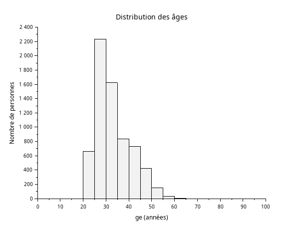
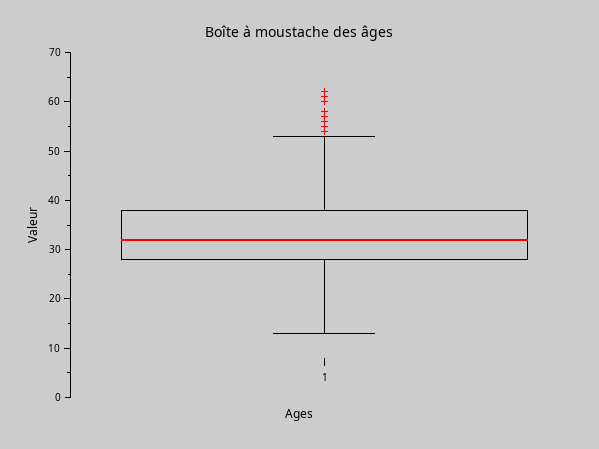
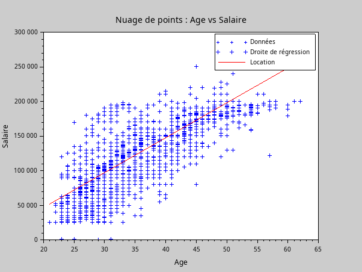
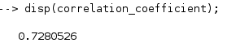
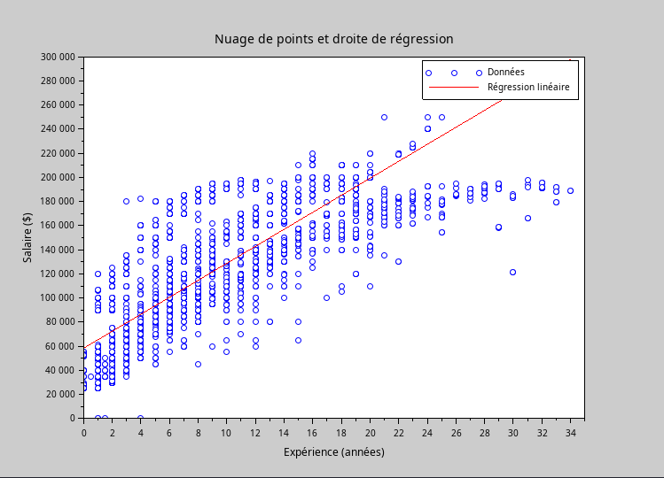
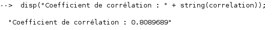
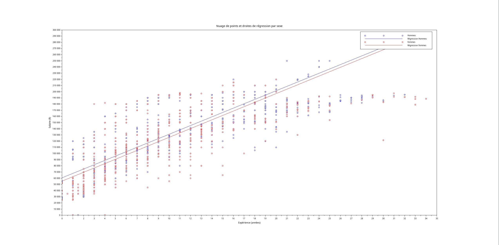
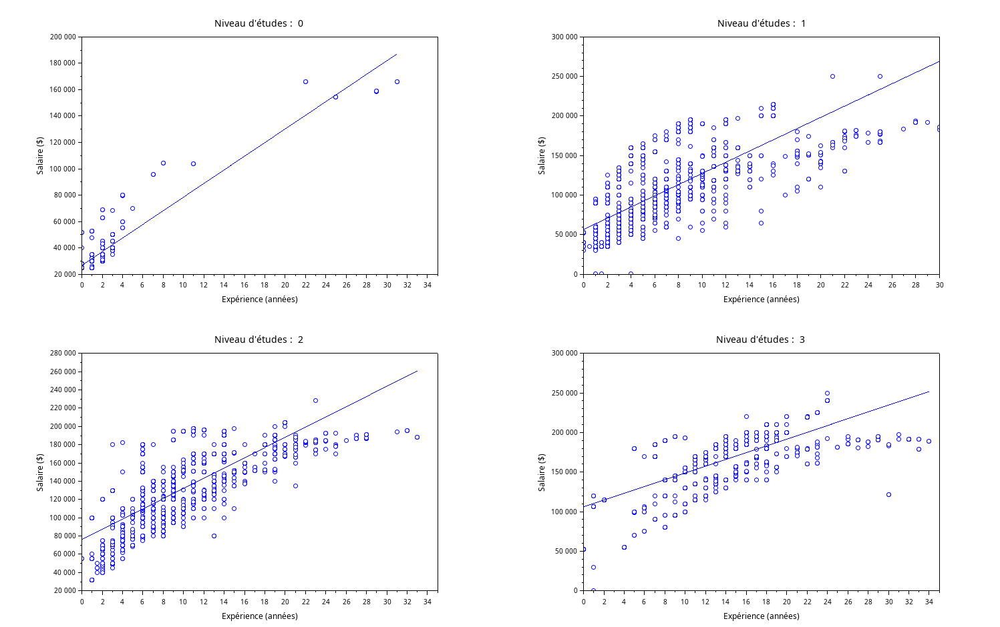

# SAEMATH

## Exercice 1

### 1)

```
// Charger les données du fichier data.csv
data_nbr = csvRead('data.csv');
data_txt = csvRead('data.csv', [], [], 'string');

// Initialisation des variables
genres = data_txt(:, 3);
nb_homme = sum(genres == 'Male');
nb_femme = sum(genres == 'Female');
nb_other = sum(genres == 'Other');

//Affichage du graphe
pie([nb_homme, nb_femme,nb_other], ['Homme', 'Femme','Other']);
title('Répartition des genres');
legend('Homme', 'Femme', 'Other');
```


### 2)

```
// Charger les données du fichier data.csv
data_nbr = csvRead('data.csv');
data_txt = csvRead('data.csv', [], [], 'string');

// Initialisation des variables issues des données du fichier data.csv
genders = data_txt(:, 3);
education_levels = data_nbr(:, 4);

// Nombre de diplomé pour chaque combinaison de genre et de niveau d'études
male_HS = sum(genders == 'Male' & education_levels == 0);
male_bachelor = sum(genders == 'Male' & education_levels == 1);
male_master = sum(genders == 'Male' & education_levels == 2);
male_Phd = sum(genders == 'Male' & education_levels == 3);

female_HS = sum(genders == 'Female' & education_levels == 0);
female_bachelor = sum(genders == 'Female' & education_levels == 1);
female_master = sum(genders == 'Female' & education_levels == 2);
female_Phd = sum(genders == 'Female' & education_levels == 3);


other_HS = sum(genders == 'Other' & education_levels == 0);
other_bachelor = sum(genders == 'Other' & education_levels == 1);
other_master = sum(genders == 'Other' & education_levels == 2);
other_Phd = sum(genders == 'Other' & education_levels == 3);

// Données pour le graphe

// Pour les hommes
male_data = [male_HS, male_bachelor, male_master, male_Phd];


// Pour les femmes
female_data = [female_HS, female_bachelor, female_master, female_Phd];


// Pour les autres genres
other_data = [other_HS, other_bachelor, other_master, other_Phd];

// Affichage du graphe
bar([male_data' female_data' other_data']);
title("Répartition diplôme par genre");
xlabel("Niveau education");
ylabel("Nombre de diplômés");
xtick_labels = ["HS", "Bachelor", "Master", "PhD"];
xtitle(xtick_labels);
legend(["Hommes", "Femmes", "Autres"]);

```


### 3)
```
// Charger les données du fichier data.csv
data_txt = csvRead('data.csv', [], [], 'string');

// Initialisation des variables à partir du fichier data.csv
professions = data_txt(:, 5);

// Trouver les professions uniques et compter les occurrences
[unique_professions, idx] = unique(professions, "r");
counts = zeros(size(unique_professions, 1), 1);

for i = 1:size(unique_professions, 1)
    counts(i) = sum(strcmp(professions, unique_professions(i)));
end

// Trier les professions par ordre décroissant d'effectifs
[sorted_counts, sort_idx] = gsort(counts, "g");
sorted_professions = unique_professions(sort_idx);


// Sélectionner les 10 professions les plus représentées
top_10_counts = sorted_counts(1:10);
top_10_professions = sorted_professions(1:10);

//Affichage du graphe
bar(top_10_counts);
title("Effectifs des 10 professions les plus représentées");
xlabel("Professions");
ylabel("Nombre de personnes");
set(gca(), "xticklabels", top_10_professions);
xtitle(top_10_professions);
set(gca(), "x_tick_angle", 45);
```


### 4)

```
// Charger les données du fichier data.csv
data_txt = csvRead('data.csv', [], [], 'string');

// Initialisation des variables à partir du fichier data.csv
genders = data_txt(:, 3);
professions = data_txt(:, 5);

// Trouver les indexe des entrées pour les femmes et les hommes puis extraire les professions
idx_female = find(genders == 'Female');
idx_male = find(genders == 'Male');

professions_female = professions(idx_female);
professions_male = professions(idx_male);

// Trouver les professions les plus fréquentes pour chaque genre
function [most_frequent_profession] = find_most_frequent_profession(professions)

    [unique_professions, idx] = unique(professions, "r");
    counts = zeros(size(unique_professions, 1), 1);

    for i = 1:size(unique_professions, 1)
        counts(i) = sum(strcmp(professions, unique_professions(i)));
    end

    [max_count, max_idx] = max(counts);
    most_frequent_profession = unique_professions(max_idx);
endfunction

most_frequent_profession_female = find_most_frequent_profession(professions_female);
most_frequent_profession_male = find_most_frequent_profession(professions_male);

// Enfin afficher la réponse
disp("La profession la plus fréquente des femmes est : " + most_frequent_profession_female);
disp("La profession la plus fréquente des hommes est : " + most_frequent_profession_male);

```


### 5)

```
// Charger les données du fichier data.csv
data_nbr = csvRead('data.csv');
data_txt = csvRead('data.csv', [], [], 'string');

// Initialisation des variables à partir du fichier data.csv
education_levels = data_nbr(:, 4);
salaries = data_nbr(:, 7);
ages = data_nbr(:, 2);
experience_years = data_nbr(:, 6);

// Liste des niveaux d'études
education_levels = ['0', '1', '2', '3'];

// Initialiser des vecteurs pour stocker les moyennes
mean_salaries = zeros(4, 1);
mean_ages = zeros(4, 1);
mean_experience_years = zeros(4, 1);

//Boucle pour calculer les moyenne de chaque niveau d'étude
for i = 1:4
    idx = find(education_levels == education_levels(i));
    
    
    mean_salaries(i) = mean(salaries(idx));
    mean_ages(i) = mean(ages(idx));
    mean_experience_years(i) = mean(experience_years(idx));
end


// Enfin afficher le résultat
for i = 1:4
    disp("Niveau etudes : " + string(education_levels(i)));
    disp("Salaire moyen : " + string(mean_salaries(i)));
    disp("Age moyen : " + string(mean_ages(i)));
    disp("Expérience moyenne (en années) : " + string(mean_experience_years(i)));
    disp(" ");
end
```


### 6)

```
// Charger les données du fichier data.csv
data_txt = csvRead('data.csv', [], [], 'string');
data_nbr = csvRead('data.csv');

// Initialisation des variables à partir du fichier data.csv
genders = data_txt(:, 3);
salaries = data_nbr(:, 7);
ages = data_nbr(:, 2);
experience_years = data_nbr(:, 6);


// Liste des genres 
gender_types = ["Male", "Female", "Other"];


// Initialiser des vecteurs pour stocker les moyennes
mean_salaries = zeros(3, 1);
mean_ages = zeros(3, 1);
mean_experience_years = zeros(3, 1);


// Boucle pour calculer les moyenne pour chaque genre
for i = 1:3
    idx = find(genders == gender_types(i));
    
    mean_salaries(i) = mean(salaries(idx));
    mean_ages(i) = mean(ages(idx));
    mean_experience_years(i) = mean(experience_years(idx));
end


// Enfin afficher le résultat
for i = 1:3
    disp("Genre : " + string(gender_types(i)));
    disp("Salaire moyen : " + string(mean_salaries(i)));
    disp("Age moyen : " + string(mean_ages(i)));
    disp("Expérience moyenne (en années) : " + string(mean_experience_years(i)));
    disp(" ");
end


```


## Exercice 2
### 1)

```
// Charger les données du fichier data.csv
data = csvRead('data.csv');

// Initialisation des variables à partir du fichier data.csv
ages = data(:, 2);


classes = [0:5:100];


// Trouver les valeurs des âges 
valeurs_valides = find(ages >= 0);


// Affichage du graphe
histplot(classes, ages(valeurs_valides), normalization=%f);
title("Distribution des âges");
xlabel(" ge (années)");
ylabel("Nombre de personnes");
```



### 2)
```
//Charger les données du fichier data.csv
data = csvRead('data.csv');


//Initialisation des variables a partir du fichier data.csv
experience_years = data(:, 6);

classes = [0:5:50];

// Trouver les valeurs de expérience 
valeurs_valides = find(experience_years >= 0);


// Affichage du graphe
histplot(classes, experience_years(valeurs_valides), normalization=%f);
title("Distribution de expérience");
xlabel("Années expérience");
ylabel("Nombre de personnes");

```


### 3)

```
// Charger les données du fichier data.csv
data = csvRead('data.csv');
disp("Données chargées :");
disp(data(1:10, :));  // Afficher les 10 premières lignes des données pour vérification


// Initialisation des variables à partir du fichier data.csv
ages = data(:, 2);
disp("Colonne des âges extraite :");
disp(ages(1:10));  // Afficher les 10 premiers âges pour vérification


// Vérifier les valeurs invalides
invalid_ages = ages(find(ages < 0));
if ~isempty(invalid_ages) then
    disp("Valeurs invalides trouvées dans la colonne des âges :");
    disp(invalid_ages);
end


// Calculer les statistiques descriptives de l'âge
min_age = min(ages);
disp("Minimum calculé : " + string(min_age));


max_age = max(ages);
disp("Maximum calculé : " + string(max_age));


mean_age = mean(ages);
disp("Moyenne calculée : " + string(mean_age));


median_age = median(ages);
disp("Médiane calculée : " + string(median_age));


// Fonction pour calculer le mode
function mode_value = calc_mode(data)
    unique_values = unique(data);
    counts = zeros(size(unique_values));
    for i = 1:length(unique_values)
        counts(i) = sum(data == unique_values(i));
    end
    [max_count, max_idx] = max(counts);  // Obtenir la valeur max et son indice
    mode_value = unique_values(max_idx);
endfunction


mode_age = calc_mode(ages);
disp("Mode calculé : " + string(mode_age));


std_dev_age = stdev(ages);
disp("Écart type calculé : " + string(std_dev_age));


// Fonction pour calculer les quartiles
function quartiles = calc_quartiles(data)
    sorted_data = gsort(data, "g", "i");  // Trier les données dans l'ordre croissant
    n = length(sorted_data);
    q1 = sorted_data(round(0.25 * (n + 1)));
    q2 = sorted_data(round(0.50 * (n + 1)));  // C'est la médiane
    q3 = sorted_data(round(0.75 * (n + 1)));
    quartiles = [q1, q2, q3];
endfunction


quartiles_age = calc_quartiles(ages);
disp("Quartiles calculés :");
disp("1er quartile (Q1) : " + string(quartiles_age(1)));
disp("Médiane (Q2) : " + string(quartiles_age(2)));
disp("3ème quartile (Q3) : " + string(quartiles_age(3)));


iqr_age = quartiles_age(3) - quartiles_age(1);
disp("Interquartile range (IQR) calculé : " + string(iqr_age));


// Enfin afficher le résultat
disp("Statistiques descriptives de age :");
disp("------------------------------------");
disp("Minimum : " + string(min_age));
disp("Maximum : " + string(max_age));
disp("Moyenne : " + string(mean_age));
disp("Médiane : " + string(median_age));
disp("Mode : " + string(mode_age));
disp("Écart type : " + string(std_dev_age));
disp("1er quartile (Q1) : " + string(quartiles_age(1)));
disp("Médiane (Q2) : " + string(quartiles_age(2)));
disp("3ème quartile (Q3) : " + string(quartiles_age(3)));
disp("Interquartile range (IQR) : " + string(iqr_age));
```


### 4)

```
// Installer le paquet stixbox
atomsInstall("stixbox");

// Charger le paquet stixbox
atomsLoad("stixbox");

// Charger les données du fichier data.csv
data = csvRead('data.csv');

// Initialisation des variables à partir du fichier data.csv
ages = data(:, 2);

// Vérifier les valeurs invalides
invalid_ages = ages(find(ages < 0));
if ~isempty(invalid_ages) then
    disp("Valeurs invalides trouvées dans la colonne des âges :");
    disp(invalid_ages);
end

// Supprimer les âges invalides 
valid_ages = ages(find(ages >= 0));


// Affichage de la boîte à moustache pour les âges
figure();
boxplot(valid_ages);
title('Boîte à moustache des âges');
xlabel('Ages');
ylabel('Valeur');

```


## Exercice 3

### 1)
```
data_nbr = csvRead('data.csv');
data_txt = csvRead('data.csv', [], [], 'string');

genre = data_txt(:, 3);
salaire = data_nbr(:, 7);

D_homme = D(genre == 'Male',:); 
D_femme = D(genre == 'Female',:); 
salaire_homme = D_homme(:,7); 
salaire_femme = D_femme(:,7); 
subplot(2, 1, 1); 
histplot(num_bins, salaire_homme); 
title("Distribution des salaires pour les hommes"); 
xlabel("Salaire"); 
ylabel("Fréquence"); 
subplot(2, 1, 2); 
histplot(num_bins, salaire_femme); 
title("Distribution des salaires pour les femmes"); 
xlabel("Salaire"); 
ylabel("Fréquence");
```

### 2)
```
// Charger les données à partir du fichier CSV
data = csvRead("data.csv");

// Afficher les premières lignes des données 
disp("Données chargées :");
disp(data(1:10, :));

// Définir les indices de colonnes pour le niveau etudes et le salaire
index_niveau_etudes = 6;  
index_salaire = 7; 

// Extraire les colonnes du niveau etudes et des salaires
niveaux_etudes = data(:, index_niveau_etudes);
salaires = data(:, index_salaire);

// Afficher les premières valeurs des niveaux etudes et des salaires 
disp("Niveaux etudes :");
disp(niveaux_etudes(1:10));
disp("Salaires :");
disp(salaires(1:10));

// Initialiser des variables pour stocker les salaires moyens par niveau etudes
salaires_hs = [];
salaires_bachelor = [];
salaires_master = [];
salaires_phd = [];

// Diviser les salaires en groupes selon le niveau etudes et calculer les salaires moyens
for i = 1:length(niveaux_etudes)
    if niveaux_etudes(i) == 0 then
        salaires_hs = [salaires_hs, salaires(i)];
    elseif niveaux_etudes(i) == 1 then
        salaires_bachelor = [salaires_bachelor, salaires(i)];
    elseif niveaux_etudes(i) == 2 then
        salaires_master = [salaires_master, salaires(i)];
    elseif niveaux_etudes(i) == 3 then
        salaires_phd = [salaires_phd, salaires(i)];
    end
end

// Calculer les salaires moyens pour chaque niveau etudes
salaire_moyen_hs = mean(salaires_hs);
salaire_moyen_bachelor = mean(salaires_bachelor);
salaire_moyen_master = mean(salaires_master);
salaire_moyen_phd = mean(salaires_phd);

// Afficher les salaires moyens pour vérification
disp("Salaire moyen pour High School : " + string(salaire_moyen_hs));
disp("Salaire moyen pour Bachelor : " + string(salaire_moyen_bachelor));
disp("Salaire moyen pour Master : " + string(salaire_moyen_master));
disp("Salaire moyen pour PhD : " + string(salaire_moyen_phd));

// Créer un vecteur des niveaux etudes
niveaux = ["High School", "Bachelor", "Master", "PhD"];

// Créer un vecteur des salaires moyens par niveau etudes
salaires_moyens = [salaire_moyen_hs, salaire_moyen_bachelor, salaire_moyen_master, salaire_moyen_phd];

// Afficher les salaires moyens pour vérification
disp("Salaires moyens par niveau etudes :");
disp(salaires_moyens);

bar([salaires_moyens]);
title("Histogramme des salaires moyens par niveau etudes");
xlabel("Niveau etudes");
ylabel("Salaire moyen");
```
### 3)
```
 // Charger les données à partir du fichier CSV
data = csvRead('data.csv');
disp("Données chargées :");
disp(data(1:10, :));  // Afficher les 10 premières lignes des données pour vérification

// Extraire la colonne des salaires (supposons qu'elle soit la 7ème colonne)
salaires = data(:, 7);
disp("Colonne des salaires extraite :");
disp(salaires(1:10));  // Afficher les 10 premiers salaires pour vérification

// Vérifier les valeurs non définies ou invalides
invalid_salaries = salaires(find(salaires < 0));
if ~isempty(invalid_salaries) then
    disp("Valeurs invalides trouvées dans la colonne des salaires :");
    disp(invalid_salaries);
end

// Calculer les statistiques descriptives des salaires
min_salary = min(salaires);
disp("Minimum calculé : " + string(min_salary));

max_salary = max(salaires);
disp("Maximum calculé : " + string(max_salary));

mean_salary = mean(salaires);
disp("Moyenne calculée : " + string(mean_salary));

median_salary = median(salaires);
disp("Médiane calculée : " + string(median_salary));

std_dev_salary = stdev(salaires);
disp("Écart type calculé : " + string(std_dev_salary));

// Fonction personnalisée pour calculer le mode
function mode_value = calc_mode(data)
    unique_values = unique(data);
    counts = zeros(size(unique_values));
    for i = 1:length(unique_values)
        counts(i) = sum(data == unique_values(i));
    end
    [max_count, max_idx] = max(counts);  // Obtenir la valeur max et son indice
    mode_value = unique_values(max_idx);
endfunction

mode_salary = calc_mode(salaires);
disp("Mode calculé : " + string(mode_salary));

// Fonction personnalisée pour calculer les quartiles
function quartiles = calc_quartiles(data)
    sorted_data = gsort(data, "g", "i");  // Trier les données dans l'ordre croissant
    n = length(sorted_data);
    q1 = sorted_data(round(0.25 * (n + 1)));
    q2 = sorted_data(round(0.50 * (n + 1)));  // C'est la médiane
    q3 = sorted_data(round(0.75 * (n + 1)));
    quartiles = [q1, q2, q3];
endfunction

quartiles_salary = calc_quartiles(salaires);
disp("Quartiles calculés :");
disp("1er quartile (Q1) : " + string(quartiles_salary(1)));
disp("Médiane (Q2) : " + string(quartiles_salary(2)));
disp("3ème quartile (Q3) : " + string(quartiles_salary(3)));

iqr_salary = quartiles_salary(3) - quartiles_salary(1);
disp("Interquartile range (IQR) calculé : " + string(iqr_salary));

// Afficher les résultats finaux
disp("Statistiques descriptives des salaires :");
disp("-----------------------------------------");
disp("Minimum : " + string(min_salary));
disp("Maximum : " + string(max_salary));
disp("Moyenne : " + string(mean_salary));
disp("Médiane : " + string(median_salary));
disp("Mode : " + string(mode_salary));
disp("Écart type : " + string(std_dev_salary));
disp("1er quartile (Q1) : " + string(quartiles_salary(1)));
disp("Médiane (Q2) : " + string(quartiles_salary(2)));
disp("3ème quartile (Q3) : " + string(quartiles_salary(3)));
disp("Interquartile range (IQR) : " + string(iqr_salary));

// Tracer une boîte à moustaches
boxplot(salaires);
title("Boîte à moustaches des salaires");
ylabel("Salaires");

```

### 4)
```
// Charger les données à partir du fichier CSV
data = csvRead('data.csv');
data_txt = csvRead('data.csv', [], [], 'string');
disp("Données chargées :");
disp(data(1:10, :));  // Afficher les 10 premières lignes des données pour vérification

// Définir les indices de colonnes pour le genre et les salaires
index_genre = 3;  // Supposons que la colonne 3 soit le genre
index_salaire = 7; // Supposons que la colonne 7 soit le salaire

// Extraire les colonnes des genres et des salaires
genres = data_txt(:, index_genre);
salaires = data(:, index_salaire);

// Afficher les premières valeurs des genres et des salaires pour vérification
disp("Genres :");
disp(genres(1:10));
disp("Salaires :");
disp(salaires(1:10));

// Séparer les données par genre en vérifiant les chaînes de caractères
salaires_male = salaires(genres == "Male");
salaires_female = salaires(genres == "Female");
salaires_other = salaires(genres == "Other");

// Fonction personnalisée pour calculer les statistiques descriptives
function [min_val, max_val, mean_val, median_val, mode_val, std_dev_val, quartiles_val, iqr_val] = calc_stats(data)
    min_val = min(data);
    max_val = max(data);
    mean_val = mean(data);
    median_val = median(data);

    // Calcul du mode
    unique_values = unique(data);
    counts = zeros(size(unique_values));
    for i = 1:length(unique_values)
        counts(i) = sum(data == unique_values(i));
    end
    // Obtenir la valeur maximale et son indice
    [max_count, max_idx] = max(counts);
    mode_val = unique_values(max_idx);

    std_dev_val = stdev(data);

    // Calcul des quartiles
    sorted_data = gsort(data, "g", "i");
    n = length(sorted_data);
    q1 = sorted_data(round(0.25 * (n + 1)));
    q2 = sorted_data(round(0.50 * (n + 1)));
    q3 = sorted_data(round(0.75 * (n + 1)));
    quartiles_val = [q1, q2, q3];

    iqr_val = q3 - q1;
endfunction

// Calcul des statistiques pour les hommes (Male)
if ~isempty(salaires_male) then
    [min_m, max_m, mean_m, median_m, mode_m, std_dev_m, quartiles_m, iqr_m] = calc_stats(salaires_male);
end

// Calcul des statistiques pour les femmes (Female)
if ~isempty(salaires_female) then
    [min_f, max_f, mean_f, median_f, mode_f, std_dev_f, quartiles_f, iqr_f] = calc_stats(salaires_female);
end

// Calcul des statistiques pour les autres genres (Other)
if ~isempty(salaires_other) then
    [min_o, max_o, mean_o, median_o, mode_o, std_dev_o, quartiles_o, iqr_o] = calc_stats(salaires_other);
end

// Afficher les résultats finaux pour les hommes
if ~isempty(salaires_male) then
    disp("Statistiques descriptives des salaires pour les hommes :");
    disp("--------------------------------------------------------");
    disp("Minimum : " + string(min_m));
    disp("Maximum : " + string(max_m));
    disp("Moyenne : " + string(mean_m));
    disp("Médiane : " + string(median_m));
    disp("Mode : " + string(mode_m));
    disp("Écart type : " + string(std_dev_m));
    disp("1er quartile (Q1) : " + string(quartiles_m(1)));
    disp("Médiane (Q2) : " + string(quartiles_m(2)));
    disp("3ème quartile (Q3) : " + string(quartiles_m(3)));
    disp("Interquartile range (IQR) : " + string(iqr_m));
end

// Afficher les résultats finaux pour les femmes
if ~isempty(salaires_female) then
    disp("Statistiques descriptives des salaires pour les femmes :");
    disp("--------------------------------------------------------");
    disp("Minimum : " + string(min_f));
    disp("Maximum : " + string(max_f));
    disp("Moyenne : " + string(mean_f));
    disp("Médiane : " + string(median_f));
    disp("Mode : " + string(mode_f));
    disp("Écart type : " + string(std_dev_f));
    disp("1er quartile (Q1) : " + string(quartiles_f(1)));
    disp("Médiane (Q2) : " + string(quartiles_f(2)));
    disp("3ème quartile (Q3) : " + string(quartiles_f(3)));
    disp("Interquartile range (IQR) : " + string(iqr_f));
end

// Afficher les résultats finaux pour les autres genres
if ~isempty(salaires_other) then
    disp("Statistiques descriptives des salaires pour les autres genres :");
    disp("--------------------------------------------------------------");
    disp("Minimum : " + string(min_o));
    disp("Maximum : " + string(max_o));
    disp("Moyenne : " + string(mean_o));
    disp("Médiane : " + string(median_o));
    disp("Mode : " + string(mode_o));
    disp("Écart type : " + string(std_dev_o));
    disp("1er quartile (Q1) : " + string(quartiles_o(1)));
    disp("Médiane (Q2) : " + string(quartiles_o(2)));
    disp("3ème quartile (Q3) : " + string(quartiles_o(3)));
    disp("Interquartile range (IQR) : " + string(iqr_o));
end

// Tracer des boîtes à moustaches pour les salaires des hommes, des femmes et des autres genres
clf; // Effacer les graphiques précédents
if ~isempty(salaires_male) & ~isempty(salaires_female) & ~isempty(salaires_other) then
    boxplot([salaires_male]);
    clf;
    boxplot([salaires_female]);
    clf;
    boxplot([salaires_other]);
    clf;
else
    disp("Un ou plusieurs genres ont pas de données disponibles pour la boîte à moustaches.");
end
title('Boîtes à moustaches des salaires par genre');
ylabel('Salaires');
xlabel('Genre');
```

## Exercice 4
### 1)
```
// Charger les données du fichier data.csv
data = csvRead('data.csv');


// Initialisation des variables à partir du fichier data.csv
age = data(:, 2);
salaire = data(:, 7);


// Affichage du nuage de points
scatter(age, salaire, 10, '+');
xlabel('Age');
ylabel('Salaire');
title('Nuage de points : Age vs Salaire');

A = [ones(length(age), 1), age];

coefficients = A \ salaire;
salaire_pred = A * coefficients;


// Tracer la droite de régression
plot(age, salaire, '+'); // Tracer le nuage de points
plot(age, salaire_pred, '-r'); // Tracer la droite de régression
legend(['Données', 'Droite de régression'], 'Location', 'northwest');


// Calcul du coefficient de corrélation
mean_age = mean(age);
mean_salaire = mean(salaire);
numerateur = sum((age - mean_age) .* (salaire - mean_salaire));
denominateur = sqrt(sum((age - mean_age).^2) * sum((salaire - mean_salaire).^2));
correlation_coefficient = numerateur / denominateur;


// Affichage du coefficient de corrélation
disp(correlation_coefficient);
```



### 2)
```
// Charger les données du fichier data.csv
data = csvRead("data.csv");

// Initialisation des variables à partir du fichier data.csv
experience = data(:, 6);
salaire = data(:, 7);

n = length(experience);
sum_x = sum(experience);

sum_y = sum(salaire);
sum_xy = sum(experience .* salaire)
sum_x2 = sum(experience.^2);

b = (n * sum_xy - sum_x * sum_y) / (n * sum_x2 - sum_x^2); 
a = (sum_y - b * sum_x) / n;
clf;

// Affichage du nuage de points
plot(experience, salaire, 'bo');
xlabel('Expérience (années)');
ylabel('Salaire ($)');
title('Nuage de points et droite de régression');

// Tracer la droite de régression 
y_pred = a + b * experience;
plot(experience, y_pred, 'r-');
legend(['Données', 'Régression linéaire'], 'location', 'northwest');

// Calcul du coefficient de corrélation 
mean_experience = mean(experience);
mean_salaire = mean(salaire);
numerator = sum((experience - mean_experience) .* (salaire - mean_salaire));
denominator = sqrt(sum((experience - mean_experience).^2) * sum((salaire - mean_salaire).^2));
correlation = numerator / denominator;

// Affichage du coefficient de corrélation
disp("Coefficient de corrélation : " + string(correlation));
```



## Exercice 5
### 1)
```
// Charger les données du fichier data.csv
data_nbr = csvRead('data.csv');
data_txt = csvRead('data.csv', [], [], 'string');

// Initialisation des variables à partir du fichier data.csv
experience = data_nbr(:, 6);
salaire = data_nbr(:, 7);
sexe = data_txt(:, 3);

// Séparer les données pour les hommes et les femmes
experience_hommes = experience(sexe == 'Male');
salaire_hommes = salaire(sexe == 'Male');

experience_femmes = experience(sexe == 'Female');
salaire_femmes = salaire(sexe == 'Female');

// Calcul de la régression linéaire pour les hommes (méthode des moindres carrés)
X_hommes = [ones(length(experience_hommes), 1), experience_hommes];
coeffs_hommes = X_hommes \ salaire_hommes;
salaire_pred_hommes = X_hommes * coeffs_hommes;

// Calcul de la régression linéaire pour les femmes (méthode des moindres carrés)
X_femmes = [ones(length(experience_femmes), 1), experience_femmes];
coeffs_femmes = X_femmes \ salaire_femmes;
salaire_pred_femmes = X_femmes * coeffs_femmes;

// Afficher le nuage de points et les droites de régression
clf;
plot(experience_hommes, salaire_hommes, 'bo'); // Nuage de points pour les hommes
plot(experience_hommes, salaire_pred_hommes, 'b-'); // Droite de régression pour les hommes
plot(experience_femmes, salaire_femmes, 'ro'); // Nuage de points pour les femmes
plot(experience_femmes, salaire_pred_femmes, 'r-'); // Droite de régression pour les femmes
xlabel('Expérience (années)');
ylabel('Salaire ($)');
title('Nuage de points et droites de régression par sexe');
legend(['Hommes', 'Régression Hommes', 'Femmes', 'Régression Femmes'], 'location', 'northwest');

```


### 2)
```
// Charger les données du fichier data.csv
data = csvRead('data.csv');

// Initialisation des variables à partir du ficher data.csv
experience = data(:, 6);
salaire = data(:, 7);
niveau_etudes = data(:, 4); // Supposons que la colonne 4 contient les niveaux d'études


niveaux = unique(niveau_etudes);


// Tracer le nuage de points et les droites de régression pour chaque niveau d'études
clf;
for i = 1:length(niveaux)
    niveau = niveaux(i);


    // Sélectionner les indices pour ce niveau d'études
    indices_niveau = find(niveau_etudes == niveau);


    // Sélectionner les données pour ce niveau d'études
    experience_niveau = experience(indices_niveau);
    salaire_niveau = salaire(indices_niveau);


    // Si aucune donnée pour ce niveau, passer au suivant
    if isempty(experience_niveau) || isempty(salaire_niveau)
        continue;
    end


    // Calculer les coefficients de régression linéaire
    X_niveau = [ones(length(experience_niveau), 1), experience_niveau];
    coeffs_niveau = X_niveau \ salaire_niveau;
    salaire_pred_niveau = X_niveau * coeffs_niveau;


    // Tracer le nuage de points et la droite de régression
    subplot(2, 2, i);
    plot(experience_niveau, salaire_niveau, 'o');
    plot(experience_niveau, salaire_pred_niveau, '-');
    xlabel('Expérience (années)');
    ylabel('Salaire ($)');
    title(['Niveau d''études : ', string(niveau)]);
end

```



